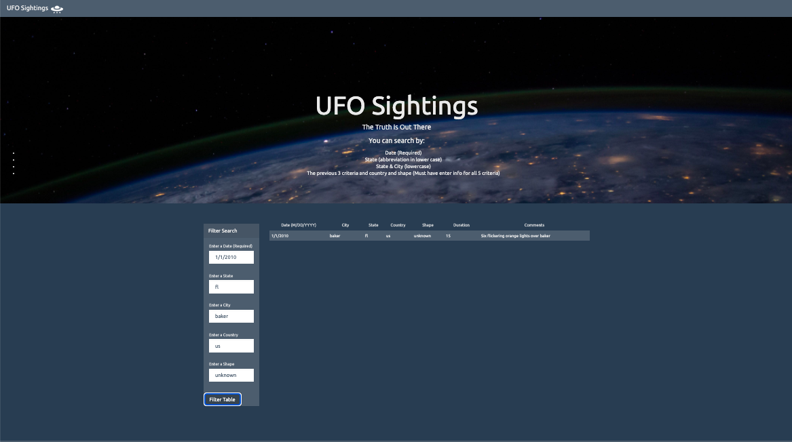

# 14-Javascript-UFOFinder

## Background

Creating a table dynamically based upon an UFO dataset. It also allows users to filter the table data for specific values. I only used pure JavaScript, HTML, and CSS, and D3.js on my web pages.

### Level 1: Automatic Table and Date Search

* Using the UFO dataset provided in the form of an array of JavaScript objects, write code that appends a table to the web page and then adds new rows of data for each UFO sighting.

  * Make sure you have a column for `date/time`, `city`, `state`, `country`, `shape`, and `comment` at the very least.

* Use a date form in your HTML document and write JavaScript code that will listen for events and search through the `date/time` column to find rows that match user input.

### Level 2: Multiple Search Categories (Optional)

* Complete all of Level 1 criteria.

* Using multiple `input` tags and/or select dropdowns, write JavaScript code so the user can to set multiple filters and search for UFO sightings using the following criteria based on the table columns:

  1. `date/time`
  2. `city`
  3. `state`
  4. `country`
  5. `shape`

- - -

### Dataset

* [UFO Sightings Data](StarterCode/static/js/data.js)
